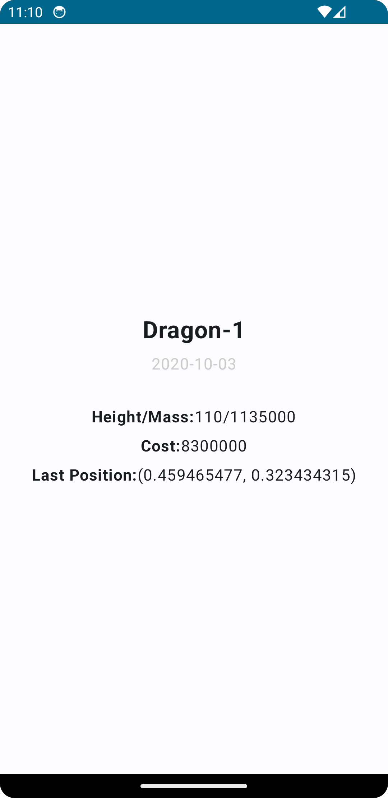

# Modules
- **app**: Runs navigation that on navigation module
- **data**: Data access layer
- **domain**: Business logic layer
- **core**: Core business models, classes and components
- **common**: Common things like constants
- **navigation**: Navigation builder
- **feature-satellites**: UI layer of satellites feature
- **feature-satelliteDetail**: UI layer of sallite detail feature

# Technologies
- Jetpack Compose
- Dagger Hilt
- Room
- Kotlin Flow
- Kotlin Coroutines
- Compose Navigation
- Kotlin Serialization

# Screenshots
| Satellite List| Satellite Detail |
| ------ | ------ |
|||
